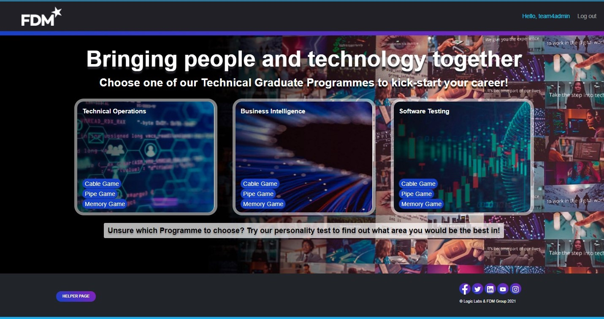
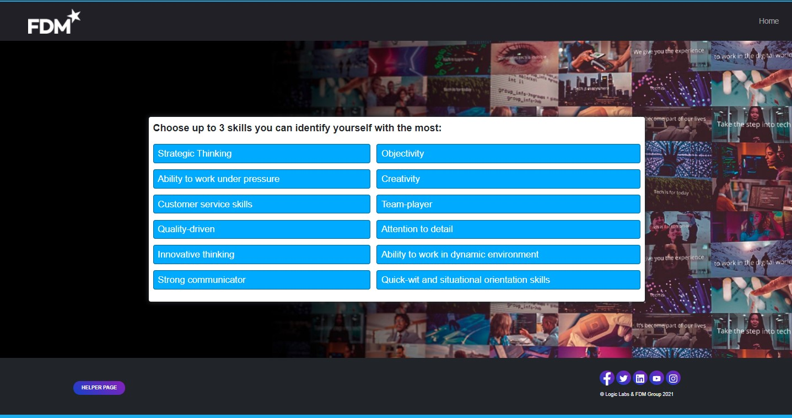
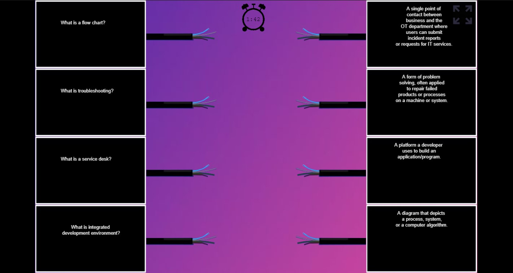
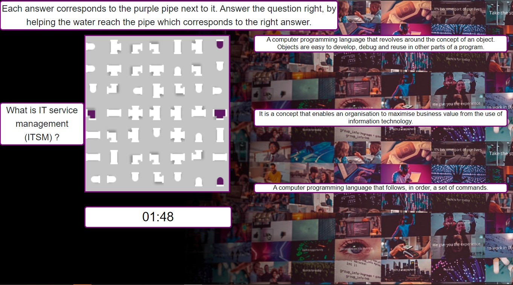

# Project: Gamification of FDM Branding
###### Created by: a 5-member team of 2nd year computer science students at Newcastle University, UK (*not mentioning names for privacy reasons*)
###### My role: full-stack Django development

---
This document contains a description of the project and the functionality available on the website, as well as the instructions on running the system locally.<br>
## Table of contents
* [Introduction](#introduction)
* [Games Available](#games-available)
* [User authentication](#user-authentication)
* [My contribution to the project](#my-contribution-to-the-project)
* [Instructions to run system locally](#instructions-to-run-system-locally)

## Introduction

The product developed is a web application which greets the user with a homepage showing three 
different career streams; Software Testing, Business Intelligence and Technical Operations. 



The user can select these streams manually or be offered a suggestion from a personality test. 
* The personality test consists of a set of 5 questions with a selection of answers for each. Answers 
are all correct however each one provides a different insight on which stream the user may best fit into.
  The results will provide a pie chart showing a clear indication of what stream the users responses have converged
  towards.
  

For each of the streams there will be 3 different games to play, all tailored to the selected stream.
* i.e. If you selected a game on the software testing stream, you will expect questions about software testing.

## Games Available

* Cable Game - The user must connect questions to answers using cables. The game will finish when
  all the cables are connected correctly, completing the circuit or if the time runs out. To control the cable, the 
  user just needs to click on the cable end on the left and to connect it to the answer you click on the cable end on 
  the right.
  <br><br>
  
* Pipe Game - The user directs the flow from a question pipe to a receiving pipe showing the correct answer. This
  will involve clicking on different pipes on the grid, rotating them and altering the flow path to ensure it goes to 
  the correct answer. There are 3 answers displayed, and the correct answer location is always random. To win you
  must direct the flow to the correct answer before the time runs out. 
  <br><br>
  
* Memory Game - The user must match up pairs of hidden icons on a grid by clicking on them and learning the location
of these icons. When a match is found, the pair is shown and coloured green on the grid, when a match is incorrect then
  the two icons selected flash red to indicate they are incorrect. The user must find all the matching pairs before the
  time runs out.
  
## User authentication

* Users can create a helper account by clicking on the helper page button at the bottom of the home page.<br>

* Helpers can view existing game questions and add new ones, as well as keep track of the best players for each game.<br>

* Newly created accounts are inactive until approved by an admin, which can take up to 24 hours.<br>
* To access the helper page on your local machine (without contacting an admin) you can log in with those credentials:

  | Username        | Password           | Access to|Accessed via  | 
  | ------------- |:-------------:| -----:| -----:|
  | team4helper      | helperhelper      | FDM Helper Page|   Helper page button in footer |

## My contribution to the project

* Most of the front-end design of the web app:<br>
  - Home page<br>
  - Results page<br>
  - All of the helper pages<br>
  - Page template, especially navbars and footers, used on other pages (e.g. personality quiz).<br>
* Most of the back-end of the web app, certainly to the pages I did frontend for.<br>
* The games, the personality quiz, Twitter upload and info email sending functionality are **_not_** done by me.<br>

* Technologies used and learnt: 
  - Django (Python 3.9)
  - HTML, JavaScript, CSS
  - Bootstrap (5.0)

## Instructions to run system locally

### Required software:

 | Software        | Version           | 
  | ------------- |:-------------:| 
  | Pycharm Professional (JetBrains)      | 2020.3 or later |#
| Python      | 3.9 |

*note there are other dependencies in a requirements.txt file and a Pipfile. Please install these into either a 
virtualenv environment or pipenv environment. I have provided both just in case you had a preference. 

The project runs on a local sqlite database stored in a file in the repository, so there is no need to install anything.

### How to run:

1. To access the project you can either:
   * Clone the project to your own repository and open it through VSC, or
   * Download the project as a zip file, unzip it to another folder and open in Pycharm.
2. Setup interpreter on python 3.9 and install dependencies from either the pipfile or requirements.txt.
3. Check if the sqlite database is working correctly by:
   * Opening the igasdb.sqlite3 file
   * Right-clicking on the database in the database panel and looking for "*Properties*"
   * Checking whether any driver files are missing and testing the connection.
4. Run the command ```python manage.py runserver``` and click the link that will look like 
 ```http://127.0.0.1:8000/```.
5. This should greet you with our homepage in your preferred browser. We have tested our application in Chrome, Firefox,
Safari and Microsoft Edge, so we recommend you use one of these.
   
Since the project has been ended and marked, the web app is now only available locally.

### A note on the test suite:

If you would like to run the test suite then you must install the latest version of
Node.js and run ```npm test``` in the terminal.
